# Accidentes aéreos

El análisis de datos históricos de accidentes aéreos desempeña un papel crucial en el trabajo relacionado con la mejora de la seguridad en la aviación. Los accidentes aéreos son sucesos inesperados e indeseados que ocurren en aeronaves y causan daños físicos tanto a las personas como a las propias aeronaves. Estos accidentes pueden involucrar diferentes tipos de aeronaves, como aviones comerciales, aviones privados, helicópteros, planeadores y globos aerostáticos.

Existen varios factores que pueden causar accidentes aéreos, entre ellos, errores humanos, fallos en los equipos, condiciones meteorológicas adversas, problemas de mantenimiento, deficiencias en la gestión del tráfico aéreo, inconvenientes en el diseño o errores de fabricación. Las consecuencias de los accidentes pueden tener un impacto tanto en términos de pérdidas humanas como económicas.

Por esta razón, la industria de la aviación, las autoridades reguladoras y los investigadores trabajan incansablemente con el objetivo de mejorar la seguridad en la aviación y prevenir accidentes futuros.

El análisis de los datos históricos de accidentes aéreos resulta fundamental en este proceso. La recopilación y el análisis sistemático de estos datos permiten a los investigadores identificar patrones, tendencias y factores que contribuyen a los accidentes, lo que a su vez ayuda a mejorar la seguridad en múltiples aspectos. Estos datos pueden utilizarse para mejorar la formación de los pilotos y el personal de mantenimiento, así como para mejorar el diseño y la fabricación de aviones y equipos de aviación.

### Propuesta de trabajo: Análisis exploratorio de datos y creación de un dashboard con KPIs

1. Análisis Exploratorio de los datos (Exploratory Data Analysis = EDA):
   - Realizar un análisis exhaustivo de los datos disponibles.
   - Incluir un resumen de estadísticas descriptivas de los datasets.
   - Realizar análisis para comprender la distribución de variables numéricas.
   
2. Dashboard:
   - Crear un dashboard funcional que esté en línea con el análisis realizado. 
   
3. KPIs (Indicadores Clave de Rendimiento):
   - Sugerir tres KPIs relevantes que estén relacionados con el análisis realizado.


# EDA


```python
#Importamos los paquetes necesarios
import pandas as pd
import numpy as np
import matplotlib.pylab as pl
import matplotlib.pyplot as plt
import matplotlib.gridspec as gridspec
import seaborn as sns
import calendar
import locale
```


```python
#Carga de datos
df = pd.read_csv('datos_henrry')
df = df.drop(['Indice','Unnamed: 0'], axis = 1)
df['Fecha'] = pd.to_datetime(df['Fecha'])

print(df.describe())

```

           Total abordo  Pasajeros a bordo  Tripulacion abordo  \
    count   4991.000000        4787.000000         4789.000000   
    mean      31.121218          26.877376            4.519524   
    std       45.479965          44.035342            3.758072   
    min        0.000000           0.000000            0.000000   
    25%        7.000000           3.000000            2.000000   
    50%       16.000000          12.000000            4.000000   
    75%       35.000000          30.000000            6.000000   
    max      644.000000         614.000000           83.000000   
    
           Cantidad de fallecidos  Pasajeros fallecidos  Tripulacion fallecida  \
    count             5000.000000           4773.000000            4773.000000   
    mean                22.294000             18.940708               3.587262   
    std                 35.000385             34.065190               3.177315   
    min                  0.000000              0.000000               0.000000   
    25%                  4.000000              1.000000               2.000000   
    50%                 11.000000              7.000000               3.000000   
    75%                 25.000000             21.000000               5.000000   
    max                583.000000            560.000000              43.000000   
    
           Fallecidos en tierra  
    count           4964.000000  
    mean               1.718372  
    std               55.495544  
    min                0.000000  
    25%                0.000000  
    50%                0.000000  
    75%                0.000000  
    max             2750.000000  
    

Iniciando por una descripción de los resultados obtenidos por describe, tenemos:

**Total a bordo:** Refleja la cantidad total de personas presentes en los aviones involucrados en los accidentes, las cuales, pueden resultar heridos o no en el accidente. La media de esta columna es de aproximadamente 31 personas, lo que indica que, en cada accidenté, hubo 31 personas a bordo. El valor máximo es 644, lo que sugiere un accidente con una cantidad excepcionalmente alta de personas a bordo, posiblemente un vuelo comercial de gran capacidad. La desviación estándar es de 45.48 índica que los valores individuales pueden variar significativamente alrededor de la media. Esto sugiere que la cantidad de personas a bordo puede fluctuar considerablemente entre diferentes accidentes y tipos de aviones.

**Pasajeros a bordo:** Indica el número de pasajeros presentes en los aviones durante los accidentes. La media es de aproximadamente 27 pasajeros. La desviación estándar de 44.04 indica que existe una variabilidad considerable en la cantidad de pasajeros involucrados en los accidentes. Esto significa que la cantidad de pasajeros puede diferir significativamente de la media en cada accidente. El valor máximo registrado es 614, por lo que, con el valor máximo de la columna total a bordo, se establece que existió un accidente de un avión comercial de gran capacidad.

**Tripulación a bordo:** En esta columna se muestra la cantidad de miembros de la tripulación presentes en los aviones durante los accidentes. La media es de aproximadamente 4,5, lo que indica que, en promedio, hay alrededor de 4 o 5 miembros de la tripulación a bordo en cada accidente. La desviación estándar de 3.76 indica una variabilidad moderada en la cantidad de miembros de la tripulación involucrados en los accidentes. El valor máximo registrado es 83, lo que indica un gran accidente, pues el valor se sale de la media de 4.

**Cantidad de fallecidos:** Refleja el número total de personas fallecidas en cada accidente. La media es de aproximadamente 22 personas fallecidas en cada accidente. Cantidad de fallecidos: La desviación estándar de esta columna es de aproximadamente 35, lo que implica que los valores individuales tienden a alejarse de la media de 22 en un rango relativamente amplio. Esto indica una variabilidad significativa en el número de fallecidos en los accidentes aéreos. El valor mínimo registrado es 0, lo que implica que en algunos accidentes no hubo víctimas mortales, mientras que el valor máximo es 583, lo que indica un accidente con un alto número de fallecidos.

**Pasajeros fallecidos:** Muestra el número de pasajeros que fallecieron en cada accidente. La media es de aproximadamente 19 pasajeros por accidente. La desviación estándar de esta columna es de aproximadamente 34, lo que sugiere una variabilidad importante de la media. El valor mínimo y máximo son 0 y 560, respectivamente, con lo cual, se concluye que, el accidente con mayor número de fallecidos 583, fue de tipo comercial, en donde, la mayor cantidad de víctimas fueron pasajeros.

**Tripulación fallecida:** Señala el número de miembros de la tripulación que fallecieron en cada accidente. La media es de aproximadamente 4 miembros de la tripulación. La desviación estándar es de 3, lo que indica una variabilidad moderada en la cantidad de miembros de la tripulación fallecidos por cada accidente, con un máximo de 43 personas tripulantes.

**Fallecidos en tierra:** En esta columna se muestra el número de personas fallecidas en tierra como consecuencia de los accidentes aéreos. El promedio de fallecidos en tierra es de aproximadamente 2, con una desviación estándar de 55.50 y un valor máximo registrado es 2750, lo que sugiere una situación excepcional, en donde, se presenta un gran accidente en una zona con gran concentración de personas.

**En resumen, estas columnas brindan información sobre la cantidad de personas a bordo de los aviones durante los accidentes, tanto en términos generales como en desgloses específicos para pasajeros y tripulación. La desviación estándar muestra la variabilidad de los valores individuales con respecto a la media en cada columna. Cuanto mayor sea la desviación estándar, mayor será la variabilidad de los datos.**


```python
# Agrupar por año y sumar la columna 'Total abordo'
temp = df.groupby(df.Fecha.dt.year)['Total abordo'].count()

# Crear el gráfico de barras
plt.figure(figsize=(12, 6))
plt.style.use('bmh')
plt.bar(temp.index, temp.values, color='blue')
plt.xlabel('Año', fontsize=10)
plt.ylabel('Cantidad', fontsize=10)
plt.title('Accidentes por año', loc='center', fontsize=14)

# Establecer el salto de 10 años en el eje x
plt.xticks(np.arange(min(temp.index), max(temp.index)+1, 10))

plt.show()
```


    
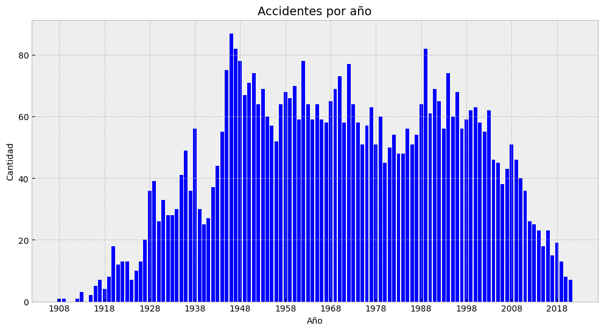
    


La gráfica indica que, desde alrededor de 1940 hasta el año 2005, se observó un notable aumento en la cantidad de accidentes aéreos. Este período de tiempo abarca un espacio de tiempo, en el cual se registró diversas incidencias y accidentes en la industria de la aviación.

El periodo comprendido entre 1960 y 2000 se observa una concentración notable de accidentes aéreos, algunos puntos para entender estos años son:

- **Crecimiento rápido de la aviación comercial:** Durante las décadas de 1940 al 2000, la aviación comercial exploto. El aumento en la demanda de viajes aéreos llevó a un incremento de vuelos y por ende pasajeros. Esta expansión de la industria implicó desafíos en términos de: tecnología, infraestructura, capacidad de gestión y coordinación, lo que, seguramente, pudo haber contribuido a una mayor cantidad de accidentes.

- **Tecnología y regulaciones en desarrollo:** La tecnología y las regulaciones de seguridad aérea estaban en proceso de desarrollo y consolidación. Aunque se habían realizado avances significativos, en comparación con décadas anteriores, aún existían áreas de mejora en términos de tecnología, como la relacionada con los sistemas de navegación y comunicación, y sobre todo, en normas de seguridad. La transición hacia mejores prácticas, y estándares más sólidos, puede no ser inmediata y de la mejor manera, lo que conlleva a mayor probabilidad de accidentes.

- **Cambios en la formación y capacitación:** Se produjeron cambios en los enfoques de formación y capacitación de pilotos y tripulación de cabina. Algunas aerolíneas estaban en procesos de adaptación a nuevos programas de entrenamiento. La implementación completa de nuevos métodos de formación podría haber llevado cierto tiempo, además de un periodo de validación y verificación, en el cual se aseguraban, que los nuevos procesos alcancen los resultados deseados. Además, durante este período de transición, pudieron existir desafíos en la implementación efectiva de las nuevas prácticas, por lo que, todo en conjunto, además de muchos más factores que se escapan del alcance de este análisis, dieron como resultado una alta cantidad de accidentes aéreos.

- **Factores regulatorios y de seguridad:** de 1960 al 2000 se realizaron importantes cambios en las regulaciones y enfoques de seguridad en la industria de la aviación. En algunos casos, hubo una mayor atención y énfasis en la seguridad aérea debido a accidentes notorios que llevaron a una revisión exhaustiva de los protocolos y estándares de seguridad.


A partir del año 2000, se observa una disminución en la cantidad de accidentes aéreos registrados, lo que indica una tendencia a la baja en comparación con las décadas anteriores. Esta disminución puede ser atribuida a diversos factores como: mejora en la tecnología y diseño de aeronaves, fortalecimiento de la regulación y la seguridad, mayor conciencia y cultura de seguridad, avances en la formación y capacitación.


```python
# Establecer la configuración regional en español
locale.setlocale(locale.LC_ALL, 'es_ES.UTF-8')

# Analisis por mes
plt.figure(figsize=(12, 6))
sns.countplot(data=df, x=df['Fecha'].dt.month)
plt.xlabel('Mes')
plt.ylabel('Cantidad')
plt.title('Número de accidentes por mes')

# Cambiar los nombres de los meses a español
meses = [calendar.month_name[i] for i in range(1, 13)]
plt.xticks(ticks=np.arange(12), labels=meses)

plt.tight_layout()
plt.show()

# Analisis por día
plt.figure(figsize=(12, 6))
sns.countplot(data=df, x=df['Fecha'].dt.dayofweek)
plt.xlabel('Día')
plt.ylabel('Cantidad')
plt.title('Número de incidentes por día')

# Cambiar los nombres de los días de la semana a español
dias_semana = list(calendar.day_name)
plt.xticks(ticks=np.arange(7), labels=dias_semana)
plt.tight_layout()
plt.show()
```


    
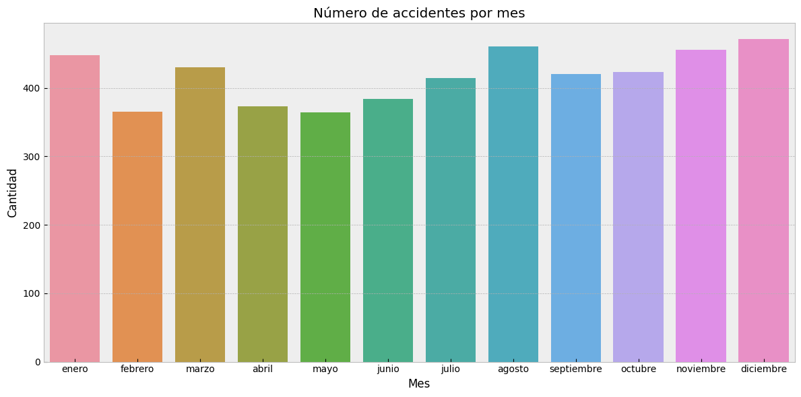
    


    
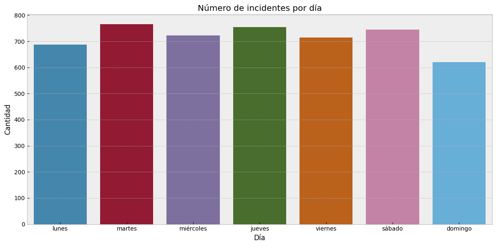
    


En el grafico se observa que los meses con mas accidentes son enero, agosto, noviembre y diciembre, ese puede ser debido entre otras cosas a:

- **Condiciones climáticas:** Durante los meses de enero, agosto, noviembre y diciembre, muchas partes del mundo experimentan condiciones climáticas desafiantes. En enero, el invierno en el hemisferio norte y el verano en el hemisferio sur pueden traer nevadas, hielo y fuertes vientos, lo que puede dificultar las operaciones aéreas. Agosto y diciembre pueden ser meses propensos a tormentas eléctricas y condiciones climáticas impredecibles, mientras que noviembre puede ser un período de transición en el que el clima puede volverse más inestable. Estas condiciones climáticas adversas aumentan el riesgo de accidentes.

- **Mayor tráfico aéreo:** Los meses de enero, agosto, noviembre y diciembre también pueden caracterizarse por un mayor tráfico aéreo debido a las vacaciones, las festividades y otros eventos importantes. Durante las vacaciones de invierno y las festividades de fin de año, muchas personas viajan en avión para reunirse con sus seres queridos o disfrutar de unas vacaciones. Esto puede resultar en un aumento en el número de vuelos y, por lo tanto, en una mayor probabilidad de accidentes.

- **Factores humanos:** Los factores humanos también desempeñan un papel crucial en los accidentes de aviones. Durante las vacaciones y los periodos festivos, los pilotos, el personal de cabina y el personal de mantenimiento pueden enfrentar mayores niveles de estrés y fatiga debido a la carga de trabajo adicional y las exigencias operativas. Esto puede afectar su rendimiento y toma de decisiones, aumentando el riesgo de errores humanos que podrían resultar en accidentes.

Por otro lado, durante los dias de la semana, no parece a ver una gran diferentes, resaltando levente los dias marte, jueves y sabados.  Es importante tener en cuenta que estas tendencias son relativas y pueden variar en diferentes partes del mundo y en diferentes contextos operativos. 


```python
# Correlacion
Correlacion = df.corr()
sns.heatmap(Correlacion, annot=True, cmap='coolwarm')
plt.tight_layout()
plt.show()
```

   
      Correlacion = df.corr()
    


    
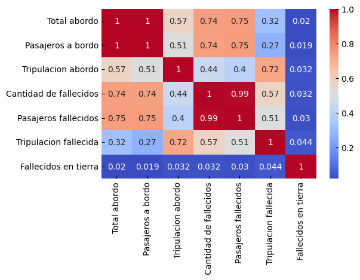
    


En el análisis de correlación, es interesante notar que los fallecidos en tierra muestran una correlación débil con las demás variables, especialmente con el número total de personas a bordo. Esta falta de correlación fuerte sugiere que la mayoría de los fallecidos en tierra se deben, entre otras cosas, a situaciones en las que los accidentes ocurren en áreas densamente pobladas.

Cuando un accidente aéreo tiene lugar en zonas urbanas o áreas con alta concentración de personas, es más probable que las víctimas sean individuos en tierra que las mismas personas abordo. Estas personas pueden incluir residentes locales, transeúntes, conductores u otros individuos que se ven afectados por el accidente debido a la ubicación geográfica en la que se produce.

Por otro lado, el número de fallecidos a bordo de la aeronave puede estar influenciado por diferentes factores, como el tipo de accidente, la capacidad de evacuación de la aeronave, los protocolos de seguridad, entre otros que no se cubren aquí. Estos factores pueden variar independientemente de la ubicación geográfica del accidente.

Es importante tener en cuenta que cada accidente aéreo es único y puede presentar circunstancias particulares. No todos los accidentes aéreos ocurren en áreas densamente pobladas, y las variables específicas pueden variar en cada caso. Si bien el análisis de correlación proporciona información útil sobre las relaciones entre las variables, es necesario complementarlo con un análisis más detallado y tener en cuenta el contexto específico para obtener una comprensión completa de los factores que contribuyen a los fallecidos en tierra en los accidentes aéreos.


```python
df_1 = pd.read_csv('datos_adicionales')
df_1 = df_1.drop(['Unnamed: 0'], axis = 1)
df_1['Fecha'] = pd.to_datetime(df_1['Fecha'])
```


```python
print(df_1.describe())
```

           Total abordo  Pasajeros a bordo  Tripulacion abordo  \
    count   4949.000000        4738.000000         4741.000000   
    mean      31.088301          26.898691            4.479646   
    std       45.438282          44.010591            3.489021   
    min        0.000000           0.000000            0.000000   
    25%        7.000000           3.000000            2.000000   
    50%       16.000000          12.000000            4.000000   
    75%       35.000000          30.000000            6.000000   
    max      644.000000         614.000000           61.000000   
    
           Cantidad de fallecidos  Pasajeros fallecidos  Tripulacion fallecida  \
    count             4959.000000           4725.000000            4726.000000   
    mean                22.338173             19.017566               3.579348   
    std                 35.026176             34.114849               3.170223   
    min                  0.000000              0.000000               0.000000   
    25%                  4.000000              1.000000               2.000000   
    50%                 11.000000              8.000000               3.000000   
    75%                 25.000000             21.000000               5.000000   
    max                583.000000            560.000000              46.000000   
    
           Fallecidos en tierra  
    count           4926.000000  
    mean               1.728177  
    std               55.708966  
    min                0.000000  
    25%                0.000000  
    50%                0.000000  
    75%                0.000000  
    max             2750.000000  
    

Mediante la incorporación de un conjunto de datos complementario, pudimos ampliar y mejorar nuestro análisis. Al utilizar la función "describe" en ambos conjuntos de datos, hemos comparado las estadísticas descriptivas clave, como la media, la mediana, la desviación estándar, entre otros. Al encontrar resultados similares, hemos obtenido una validación adicional de la consistencia y coherencia de nuestros análisis. Por lo que, al ampliar y mejorar nuestro análisis mediante el uso de un dataset complementario y al encontrar resultados similares, se fortalece la validez y la confiabilidad de los hallazgos, lo que permite tener una mayor certeza en el análisis realizado.


```python
# Establecer la configuración regional en español
locale.setlocale(locale.LC_ALL, 'es_ES.UTF-8')

# Analsis por año
plt.figure(figsize=(12, 6))
df_1['Fecha'].dt.year.value_counts().sort_index().plot(kind='line', marker='o')
plt.xlabel('Año')
plt.ylabel('Cantidad')
plt.title('Número de accidentes por año')

# Analisis por mes
plt.figure(figsize=(12, 6))
df_1['Fecha'].dt.month.value_counts().sort_index().plot(kind='line', marker='o')
plt.xlabel('Mes')
plt.ylabel('Cantidad')
plt.title('Número de accidentes por mes')

# Cambiar los nombres de los meses a español
meses = [calendar.month_name[i] for i in range(1, 13)]
plt.xticks(ticks=np.arange(12), labels=meses)

plt.tight_layout()
plt.show()

# Analisis por día
plt.figure(figsize=(12, 6))
df_1['Fecha'].dt.dayofweek.value_counts().sort_index().plot(kind='line', marker='o')
plt.xlabel('Día')
plt.ylabel('Cantidad')
plt.title('Número de incidentes por día')

# Cambiar los nombres de los días de la semana a español
dias_semana = list(calendar.day_name)
plt.xticks(ticks=np.arange(7), labels=dias_semana)

plt.tight_layout()
plt.show()

```


    
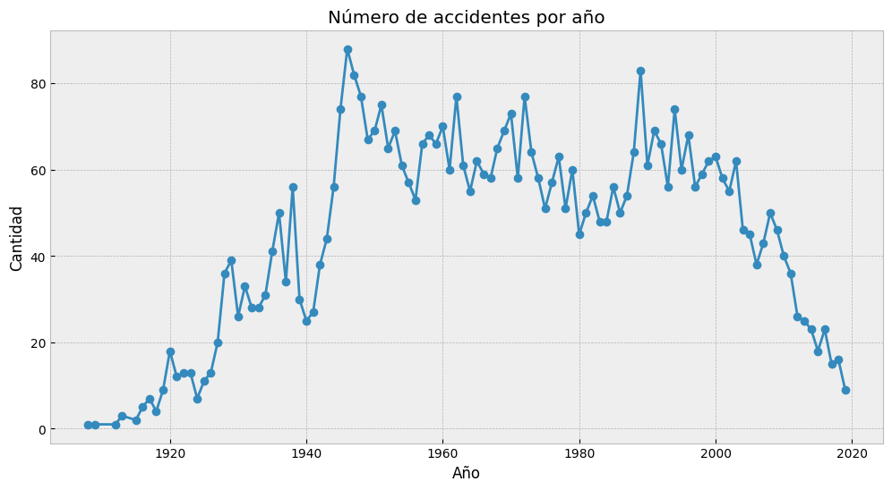
    


    
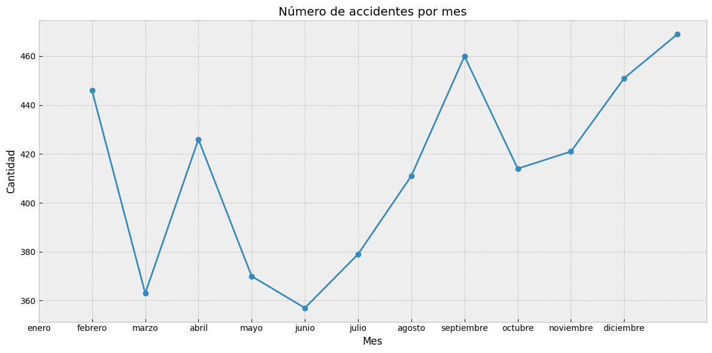
    


    
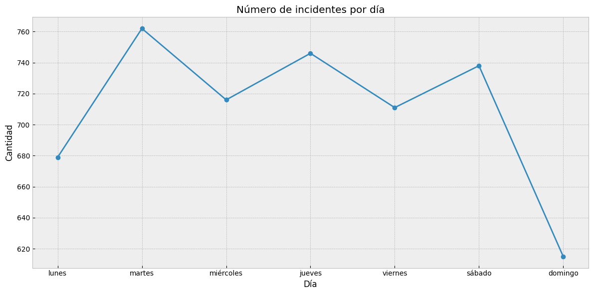
    


La gráfica muestra una concentración significativa de accidentes aéreos entre 1940 y 2000, lo cual es consistente con los hallazgos previos. Este período de tiempo parece haber sido particularmente desafiante en términos de seguridad aérea.

La concentración de accidentes aéreos en ese período podría deberse a diversos factores. Durante esas décadas, la industria de la aviación experimentó un crecimiento significativo, lo que llevó a un aumento en el número de vuelos comerciales y privados en todo el mundo. Con más aviones en el aire, existe un mayor riesgo de accidentes.

Es interesante observar que, según el análisis actual, se ha encontrado un pico significativo en septiembre en cuanto a la cantidad de accidentes aéreos por mes. Sin embargo, es importante tener en cuenta que estos resultados varían por la fuente de datos que se encuentra más actualizada. En el análisis previo, se había identificado que el mes de diciembre tenía la mayor concentración de accidentes aéreos y sigue siendo así en este análisis, por lo que se concluye que es el mes de diciembre la época del año con mayor cantidad de incidente áreos.

En cuanto a los días, es el día de martes el que tiene la mayor punta de accidentes, y domingo el día con menor cantidad.

### El siguiente dataset probiene de la base de datos de accidentes de aviación de la NTSB contiene información desde 1962 y posteriores sobre accidentes de aviación civil e incidentes seleccionados dentro de los Estados Unidos, sus territorios y posesiones, y en aguas internacionales. Por lo que no es un dataset tan completo como los anteriores.


```python
df_2 = pd.read_csv('datos_complementarios_finales')
df_2 = df_2.drop(['Unnamed: 0'], axis = 1)
df_2['Fecha'] = pd.to_datetime(df_2['Fecha'])
print(df_2.describe())
```

           Número de motores  Total heridos mortales  Total de heridos graves  \
    count        7106.000000             7106.000000              7106.000000   
    mean            1.151140                0.222910                 0.299043   
    std             0.423729                1.009659                 2.375797   
    min             0.000000                0.000000                 0.000000   
    25%             1.000000                0.000000                 0.000000   
    50%             1.000000                0.000000                 0.000000   
    75%             1.000000                0.000000                 0.000000   
    max             4.000000               49.000000               137.000000   
    
           Total de heridos leves  Total de no heridos  
    count             7106.000000          7106.000000  
    mean                 0.154799             4.400507  
    std                  0.886502            23.855129  
    min                  0.000000             0.000000  
    25%                  0.000000             0.000000  
    50%                  0.000000             1.000000  
    75%                  0.000000             2.000000  
    max                 50.000000           576.000000  
    

Iniciado podemos ver una gran discrepancia en los datos con respecto a los dos anteriores dataset, pues al solo trata los incidentes de aviación civil dentro de los Estados Unidos, el alcance del análisis, si bien limitado, puede ser de interés.

Se observa en los datos tasas de mortalidad de casi 0 en los accidentes de aviones. Se presentan datos máximo de 49 muertos, 137 heridos graves y 50 heridos leves, pero sobre todo, la columna 'Total de no heridos' presenta números mayores al resto.


```python

# Analsis por año
plt.figure(figsize=(12, 6))
df_2['Fecha'].dt.year.value_counts().sort_index().plot(kind='line', marker='o')
plt.xlabel('Año')
plt.ylabel('Cantidad')
plt.title('Número de accidentes por año')
```


    Text(0.5, 1.0, 'Número de accidentes por año')


    
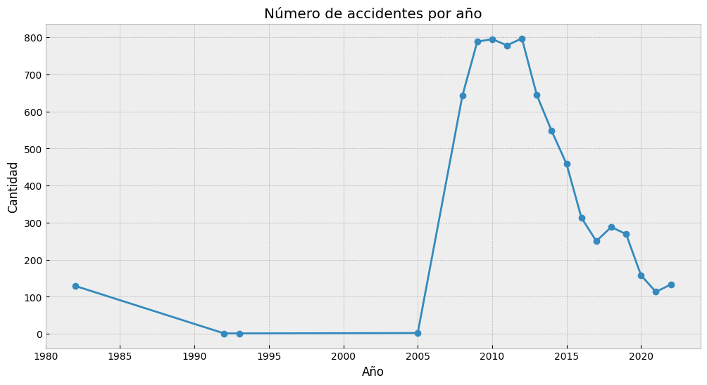
    


```python
conteo_investigacion = df_2['Investigación'].value_counts()

# Configurar el gráfico de barras
plt.bar(conteo_investigacion.index, conteo_investigacion.values, color=['blue', 'red'])
plt.xlabel('Tipo de Investigación')
plt.ylabel('Conteo')
plt.title('Conteo de Investigación')
plt.show()
```


    
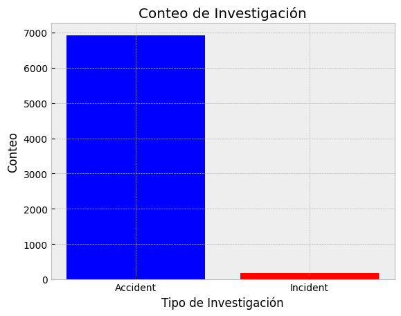
    


La seguridad aeronáutica es una preocupación fundamental en la industria de la aviación, y es importante comprender las causas detrás de los accidentes y los incidentes que ocurren en este ámbito. Al analizar la información disponible, se puede concluir que la gran mayoría de los accidentes aeronáuticos se deben a factores no intencionales, mientras que una muy pequeña minoría está relacionada con incidentes intencionales de sabotaje o atentados.

La mayoría de los accidentes aéreos ocurren como resultado de una combinación de múltiples factores, que pueden incluir errores humanos, fallas mecánicas, condiciones climáticas adversas, problemas de mantenimiento, etc. Estos factores pueden interactuar entre sí y contribuir al desarrollo de una situación peligrosa que lleva a un accidente. Por ejemplo, un error de pilotaje en combinación con una falla mecánica puede desencadenar una cadena de eventos que resulta en un accidente.

En contraste, los incidentes intencionales de sabotaje o atentados representan una proporción extremadamente pequeña de los eventos en la aviación. Estos incidentes son actos deliberados y premeditados destinados a causar daño, poner en riesgo la seguridad de las personas a bordo o afectar la integridad de las aeronaves. Si bien estos incidentes son extremadamente preocupantes debido a su naturaleza intencional y maliciosa, son excepcionalmente pequeños en comparación con el número total de accidentes no intencionados en la industria de la aviación.


```python
# Calcular el conteo de cada aeropuerto
conteo_aeropuerto = df_2['Aeropuerto'].value_counts()

# Obtener los 10 primeros aeropuertos y agrupar los demás como "Otros"
top_10_aeropuertos = conteo_aeropuerto[:10]
otros_aeropuertos = pd.Series(conteo_aeropuerto[10:].sum(), index=['Otros'])
conteo_aeropuerto = top_10_aeropuertos.append(otros_aeropuertos)

# Configurar el gráfico de barras con colores diferentes
colores = ['blue', 'red', 'green', 'orange', 'purple', 'brown', 'pink', 'gray', 'cyan', 'magenta']

plt.bar(conteo_aeropuerto.index, conteo_aeropuerto.values, color=colores[:len(conteo_aeropuerto)])
plt.xlabel('Aeropuerto')
plt.ylabel('Conteo')
plt.title('Conteo de Accidentes por Aeropuerto')
# Girar las etiquetas en diagonal
plt.xticks(rotation=45, ha='right')

# Mostrar el gráfico
plt.show()
```

    
      conteo_aeropuerto = top_10_aeropuertos.append(otros_aeropuertos)
    


    
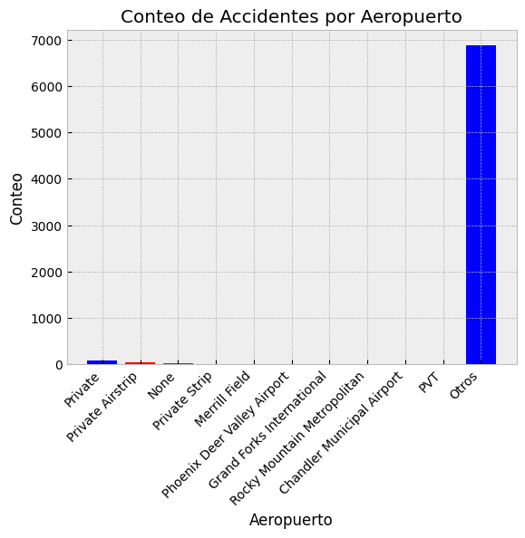
    


En los aeropuertos, no se ha identificado que exista un aeropuerto específico o grupos de aeropuertos en los cuales se presente una mayor concentración de accidentes aéreos. La seguridad en la aviación es un tópico que se viene desarrollando durante muchos años, lo que lleva a implementar rigurosos estándares y protocolos para garantizar la seguridad de los pasajeros, tripulación y aeronaves. La ocurrencia de accidentes aéreos no está asociada a un aeropuerto o grupo de aeropuertos en particular. 


```python
# Calcular el conteo de cada valor de gravedad de lesión
conteo_gravedad = df_2['Gravedad de la lesión'].value_counts()

# Configurar el gráfico de barras
plt.bar(conteo_gravedad.index, conteo_gravedad.values)
plt.xlabel('Gravedad de la lesión')
plt.ylabel('Conteo')
plt.title('Distribución de Gravedad de Lesiones')

plt.show()

# Configuración de colores
colores = ['#E4572E', '#F3A712', '#2B9C8E', '#A8C686']

# Configurar el gráfico de líneas
plt.plot(df_2['Fecha'], df_2['Total heridos mortales'], color=colores[0], label='Total heridos mortales')
plt.plot(df_2['Fecha'], df_2['Total de heridos graves'], color=colores[1], label='Total de heridos graves')
plt.plot(df_2['Fecha'], df_2['Total de heridos leves'], color=colores[2], label='Total de heridos leves')
plt.plot(df_2['Fecha'], df_2['Total de no heridos'], color=colores[3], label='Total de no heridos')

# Añadir título y etiquetas de ejes
plt.title('Evolución de Heridos por Tipo')
plt.xlabel('Fecha')
plt.ylabel('Cantidad')
plt.legend()
plt.show()
```


    
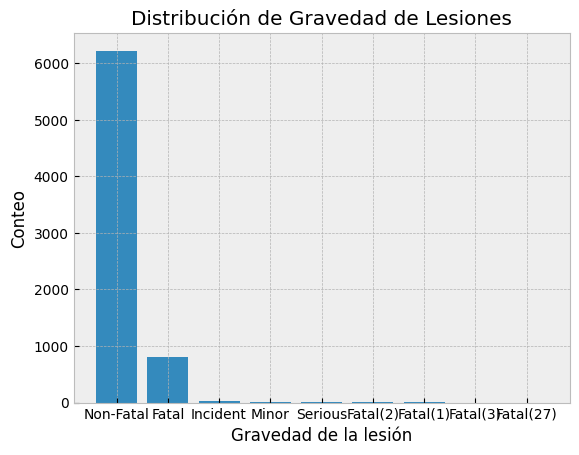
    


    
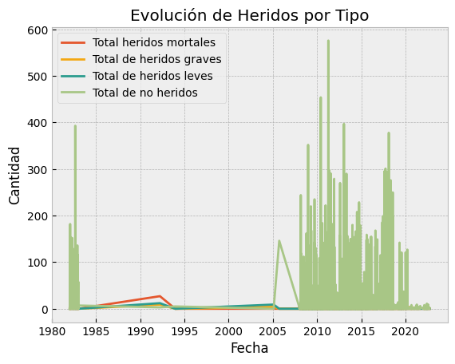
    


En el contexto de los accidentes, es importante destacar que la gran mayoría de ellos son no fatales, lo que significa que no resultan en la pérdida de vidas humanas. De hecho, menos del 20% de los accidentes a nivel general se consideran fatales o están asociados con lesiones.

Esta estadística subraya la importancia de reconocer que los accidentes no siempre implican consecuencias catastróficas, los dos gráficos presentados indican que la amplia mayoría de accidentes no presenta víctimas mortales. Aunque cualquier accidente puede ser preocupante y debe ser tomado en serio, la mayoría de los incidentes no resultan en daños graves o pérdida de vidas.


```python
# Filtrar el DataFrame para eliminar el valor "Unknown"
df_filtrado = df_2[df_2['Daño en la aeronave'] != 'Unknown']

# Calcular el conteo de cada valor de daño en la aeronave
conteo_danio = df_filtrado['Daño en la aeronave'].value_counts()

# Configuración personalizada de colores
colores = ['#E4572E', '#F3A712', '#2B9C8E']

# Configurar el gráfico de pastel
plt.pie(conteo_danio.values, labels=conteo_danio.index, autopct='%1.1f%%', colors=colores,
        startangle=90, wedgeprops={'edgecolor': 'white'})

# Añadir título y leyenda
plt.title('Distribución de Daño en la Aeronave')
plt.legend(conteo_danio.index, loc='best')

# Mostrar el gráfico
plt.axis('equal')  
plt.show()


# Calcular el conteo de cada categoría de aeronave
conteo_categoria = df_2['Categoría de aeronave'].value_counts()

# Obtener las 10 categorías más frecuentes
top_10_categorias = conteo_categoria[:10]

# Calcular la suma de las categorías restantes
otros_categorias = conteo_categoria[10:].sum()

# Crear un nuevo DataFrame para los 10 primeros y los demás como "Otros"
df_nuevo = pd.concat([top_10_categorias, pd.Series({'Otros': otros_categorias})])

# Configuración de colores
colores = ['#E4572E', '#F3A712', '#2B9C8E', '#A8C686', '#5CDB95', '#EDF5E1', '#C7F9CC', '#F9F8F8', '#C4E9F2', '#90E0EF', '#577590']

# Configurar el gráfico de barras
plt.bar(df_nuevo.index, df_nuevo.values, color=colores)


plt.title('Distribución de Categoría de Aeronave')
plt.xlabel('Categoría de Aeronave')
plt.ylabel('Cantidad')
plt.xticks(rotation=45, ha='right')
plt.show()


# Calcular el conteo de cada compañía aérea
conteo_companias = df_2['Compañía aérea'].value_counts()

# Obtener las 5 compañías más frecuentes
top_5_companias = conteo_companias[:5]

# Calcular la suma de las compañías restantes
otras_companias = conteo_companias[5:].sum()

# Crear un nuevo DataFrame para las 5 primeras y las demás como "Otras"
df_nuevo = pd.concat([top_5_companias, pd.Series({'Otros': otras_companias})])

# Configuración de colores
colores = ['#E4572E', '#F3A712', '#2B9C8E', '#A8C686', '#5CDB95']

# Configurar el gráfico de barras
plt.bar(df_nuevo.index, df_nuevo.values, color=colores)

plt.title('Distribución de Compañías Aéreas')
plt.xlabel('Compañía Aérea')
plt.ylabel('Conteo')
plt.xticks(rotation=45, ha='right')
plt.show()


# Calcular el conteo de cada compañía aérea
conteo_companias = df_2['Compañía aérea'].value_counts()

# Obtener las 5 compañías más frecuentes
top_5_companias = conteo_companias[:5]

# Calcular la suma de las compañías restantes
otras_companias = conteo_companias[5:].sum()

# Crear un nuevo DataFrame para las 5 primeras y las demás como "Otras"
df_nuevo = pd.concat([top_5_companias, pd.Series({'Otros': otras_companias})])

# Configuración de colores
colores = ['#E4572E', '#F3A712', '#2B9C8E', '#A8C686', '#5CDB95']

# Configurar el gráfico de barras
plt.bar(df_nuevo.index, df_nuevo.values, color=colores)

plt.title('Distribución de Compañías Aéreas')
plt.xlabel('Compañía Aérea')
plt.ylabel('Conteo')
plt.xticks(rotation=45, ha='right')
plt.show()
```


    
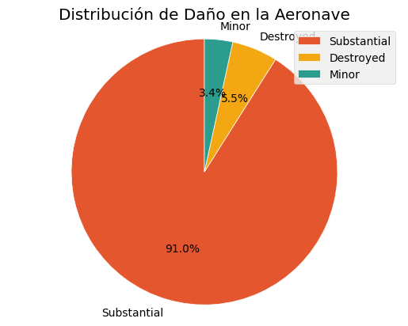
    


    
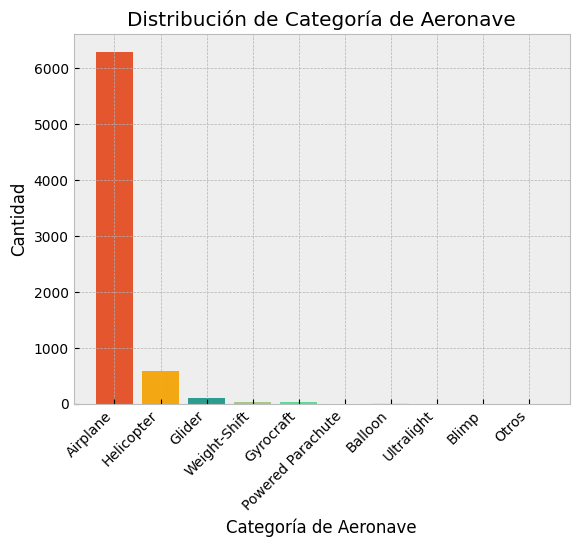
    


    
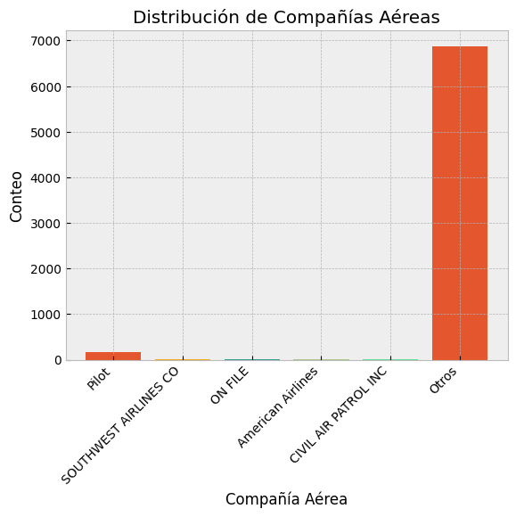
    


Se observa que la mayoría de las aeronaves son aviones, seguidas en mucha menor medida por helicópteros y otros, por lo que el dataset es consistente sobre la información relacionada con los aviones. No se encuentra una compañía que presente una mayor cantidad de accidentes respecto a otras compañías.

Si bien la mayoría de los accidentes aéreos no resultan en víctimas heridas o mortales, es importante destacar que un porcentaje significativo de estos accidentes ocasiona un daño sustancial a la aeronave. De hecho, aproximadamente el 91% de los accidentes aéreos generan daños que pueden considerarse significativos en términos de afectar la integridad y funcionalidad del avión. Valioso es tener en cuenta que la gran mayoría de los accidentes no llevan a la destrucción total de la aeronave, en donde solo alrededor del 5.5% de los accidentes ocasionan la destrucción parcial o total del avión. Aproximadamente el 3.4% de los accidentes aéreos representan daños menores, lo que significa que aunque la aeronave pueda sufrir algunos daños, estos no son significativos en términos de comprometer su capacidad de vuelo o poner en peligro la seguridad de los ocupantes.


```python
# Calcular el conteo de cada valor de condición meteorológica
conteo_condiciones = df_2['Condición meteorológica'].value_counts()

# Configuración de colores
colores = ['#E4572E', '#F3A712', '#2B9C8E', '#A8C686', '#5CDB95']

# Configurar el gráfico de pastel
plt.pie(conteo_condiciones, colors=colores, startangle=90)

# Crear una columna de valores numéricos y cadenas con el color asociado
valores_cadenas = [f'{valor} ({cadena})' for valor, cadena in zip(conteo_condiciones.values, conteo_condiciones.index)]
plt.legend(valores_cadenas, loc='center left', bbox_to_anchor=(1, 0.5), prop={'size': 8})

plt.title('Distribución de Condición Meteorológica')
plt.axis('equal')
plt.show()
```


    
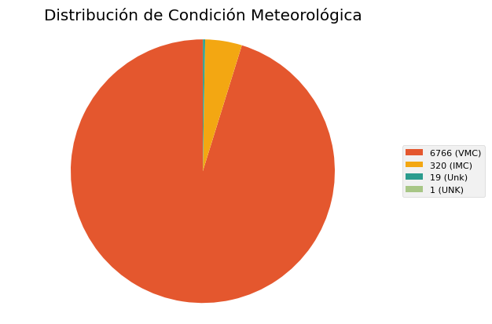
    


En la mayoría y casi totalidad de accidentes de aeronaves, se registran condiciones meteorológicas dentro de VMC ("Visual Meteorological Conditions" o Condiciones Meteorológicas Visuales). Esto significa que las condiciones de visibilidad y techo son lo suficientemente favorables para que los pilotos puedan operar la aeronave utilizando referencias visuales externas, como el terreno y otros objetos visibles.

Sin embargo, los accidentes en estos casos no se deben principalmente a condiciones meteorológicas desfavorables, sino a otros factores. Algunos ejemplos de estos factores podrían incluir:

- Errores del piloto: Los errores humanos, como errores de juicio, falta de atención, toma de decisiones incorrectas o errores de manejo de la aeronave, pueden ser la causa principal de muchos accidentes aéreos.

- Mantenimiento deficiente: Problemas técnicos o fallas en el mantenimiento adecuado de la aeronave pueden llevar a situaciones peligrosas durante el vuelo.

- Factores operacionales: El incumplimiento de los procedimientos operativos estándar, errores de comunicación entre la tripulación, falta de coordinación o errores de planificación pueden contribuir a los accidentes.

- Factores humanos: Los factores humanos, como la fatiga, el estrés, la sobrecarga de información o la falta de capacitación adecuada, pueden influir en la seguridad y desempeñar un papel en los accidentes aéreos.

Es importante destacar que solo un pequeño grupo de accidentes de aeronaves ocurre en condiciones IMC ("Instrument Meteorological Conditions" o Condiciones Meteorológicas por Instrumentos) o en condiciones desconocidas. Esto significa que las condiciones de visibilidad y techo son desfavorables y los pilotos deben confiar principalmente en los instrumentos de vuelo para la navegación y el control de la aeronave. Estas condiciones pueden aumentar los desafíos y los riesgos para los pilotos, y es crucial tener una capacitación y experiencia adecuadas para volar en estas condiciones de manera segura.

En resumen, la mayoría de los accidentes aéreos ocurren en condiciones meteorológicas favorables (VMC), lo que indica que los factores distintos de las condiciones meteorológicas son los principales contribuyentes a estos accidentes. La identificación y el abordaje adecuado de los factores humanos, errores de piloto, mantenimiento deficiente y otros factores operacionales son fundamentales para mejorar la seguridad en la aviación.
